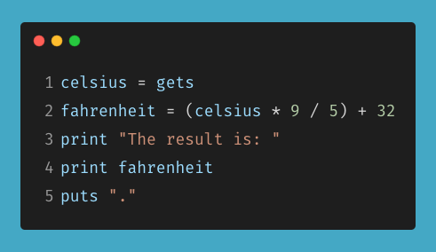
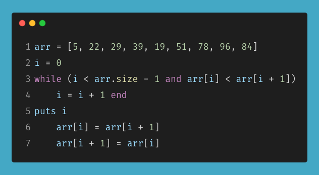
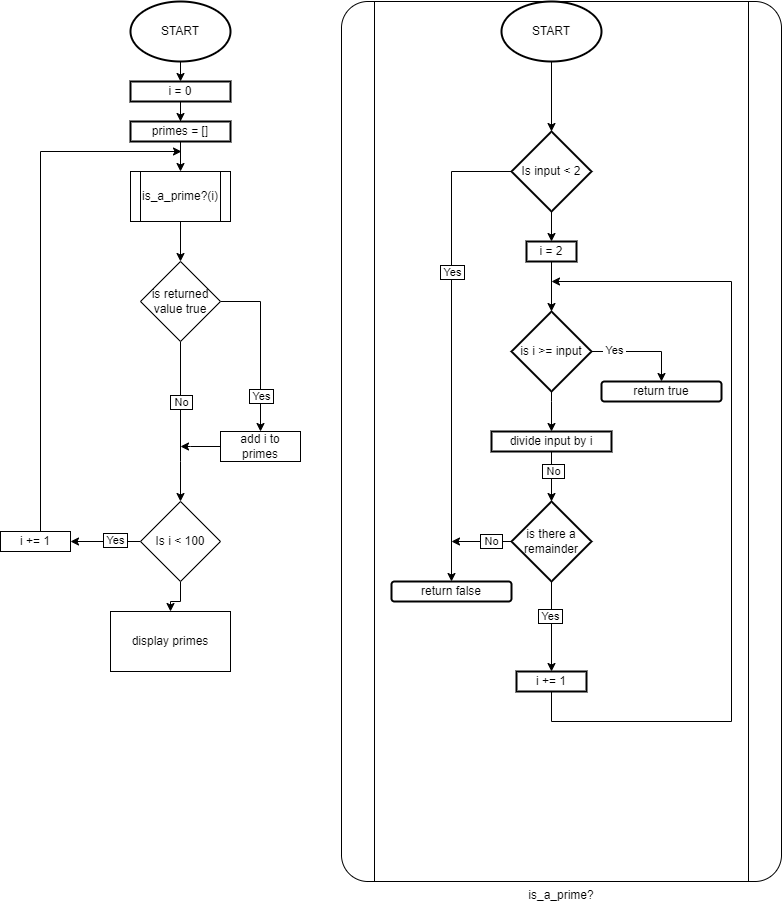

# Workbook - T1A1

## Q1

> **IDENTIFY** and **EXPLAIN** common and important components and concepts of web development markup languages


- A web development markup language is not a programming language but used by interpreters (most commonly an internet browser) to determine how to format and display text and media
- Work alongside text and media content using markers. Without the markers the content should still make sense.
- Markers can be assigned addition attributes
- Markers can be nested and can inherit attributes from parent markers


---

## Q2

> **DEFINE** the features of the following technologies that are essential in terms of the development of the internet:
> - packets
> - IP addresses (IPv4 and IPv6)
> - routers and routing
> - domains and DNS
>  
>  **EXPLAIN** how each technology has contributed to the development of the internet
> 
The first early networks relied on physical circuitry changing to provide a dedicated line for the transmission of information, these are called "Circuit Switching Networks". A good example of this is early phone networks that relied on an operator to connect lines to allow users to communicate. This type of network however is inefficient as a connection is required to be maintained regardless of whether data is being transferred and limits the amount of simultaneous users. A number of innovations over the years allowed simple networks like this to evolve into the Internet as we know it.

### Packets:

An improvement over Circuit Switching Networks was the creation of "Packet Switching Networks", where data is split up into smaller pieces called "Packets" before being transmitted. When a node in the network receives a packet it will add it to a queue to be forwarded on to another node. This process is repeated until the packet reaches its destination. This allows many users to share one connection between two nodes, and by having packets take different paths between source and destination this spreads out the bandwidth requirements of a single user between many nodes. The combination of sharing connections and distributing the network load was the keystone of the creation of the first Wide Area Packet Switching Network - "ARPANET"

A packet can be thought of as an envelope containing a message with the information required to send the message on the outside of the envelope.

A packet is comprised of two separate parts:
- The control information 
  - located in headers and/or footers
  - readable by any node on the network
  - may contain:
    - Source and destination addresses used by nodes on the network to route the packet to its destination
    - Packet order information
    - Error detection codes for the receiver to verify the payload
- The Payload
  - This is the actual data that is being sent from one user on the network to another
  - Only readable by the destination user


https://en.wikipedia.org/wiki/Network_packet

https://www.cloudflare.com/en-au/learning/network-layer/what-is-a-packet/

https://www.sciencemuseum.org.uk/objects-and-stories/arpanet-internet

### IP Addresses (IPv4/IPv6)

The creation of ARPANET led to other organisations developing their own standalone networks however these networks where incompatible with each other.
Work by 1974 led to the creation of a protocol for packet switching between networks. This led to the creation of the 'Transmission Control Program'. This program was later broken down into the 'Transmission Control Protocol' (TCP) and the 'Internet Protocols'.
During this process the term 'Internet' was first used as a shorthand for internetwork.

The TCP controls how a file is broken up into packets but the IP is responsible for defining the format of the packets as well as providing and addressing system.
The two versions of the IP addressing system in use are IPv4 and IPv6 however the two are not directly interoperable. The purpose of IP addresses are to assign every connection on the Internet a unique identifier.

IPv4 uses 32-bit addresses (4 bytes) for a total of 2<sup>32</sup> (4,294,967,296) addresses.
As early as the 1980's it became obvious that the number of available addresses would no be able to serve the growing number of devices connecting to the Internet. Many technologies have been implemented to help alleviate the shrinking number of IPv4 addresses available however the long term solution was the specification of IPv6 in 1998 with 2<sup>128</sup> (340,282,366,920,938,463,463,374,607,431,768,211,456) addresses.

https://en.wikipedia.org/wiki/Internet_Protocol

https://en.wikipedia.org/wiki/IPv4

https://en.wikipedia.org/wiki/IPv6

### Routing

In order for a packet to arrive at its destination it must be passed along through many nodes. The process of calculating the path between nodes that a packet must take is called "routing" and the network devices that perform this "Routers".

While most people will be aware of a home router or "Access Router" that performs simple IP forwarding, much more advanced routers exist connecting large enterprise networks and Internet Service Providers (ISPs) and "Core Routers" that direct network traffic around the Internet's "Backbone"

Routers on smaller networks rely on pre-configured routing tables to direct IP packets around but the routers servicing larger, more dynamic networks rely on combinations of advanced algorithms to direct IP packets between networks.

The ability for the large routers to dynamically forward IP packets between networks is crucial in allowing the forwarding of packets from their source to destination and crucial in the operation of the Internet

https://en.wikipedia.org/wiki/IP_routing

https://en.wikipedia.org/wiki/Routing

https://en.wikipedia.org/wiki/Router_(computing)

https://en.wikipedia.org/wiki/Core_router


### Domains and DNS

The DNS (Domain Name System) is an autonomous system designed to act like the phone book of the internet. Translating human readable addresses such as URLs or email addresses into IP addresses.

A domain on the Internet is a named group of networks. The entire domain name space is structured as a "Tree" data structure. The "Root Zone" is the highest level of the DNS, from here the tree divides into zones based of what are called "Top Level Domains" (TLD). Top level domains fall under a number of categories however the most common are generic TLDs (gTLD) such as `.com`, `.net` or `.org` or country code TLD's (ccTLD), eg `.au` for Australia. These zones contain the information needed to direct traffic to an IP address as well as information relating to subzones.

From here the tree continues to divide based on the next level domains.

When a domain name is read, it is read from right to left and sub-domain names are separated with a `.`.

In the example `google.com.au`: `au` is the top level domain, followed by `com`. `google` is the third level domain and because it has at least one associated IP address is also a hostname.

https://en.wikipedia.org/wiki/Top-level_domain

https://en.wikipedia.org/wiki/Domain_name

https://en.wikipedia.org/wiki/Domain_Name_System

https://en.wikipedia.org/wiki/Tree_(data_structure)


---

## Q3 

> **DEFINE** the features of the following technologies that are essential in the terms of the development of the internet:
> - TCP
> - HTTP and HTTPS
> - web browsers (requests, rendering and developer tools)
>   
> **EXPLAIN** how each technology has contributed to the development of the client and server communication over the internet *(50 - 150 words for each technology)*

### TCP (Transmission Control Protocol)

The TCP acts as an intermediate service provider between applications and the Internet Protocol.
TCP controls the splitting of data into packets,sending/ receiving of the packets, requesting re-transmission of lost packets, re-ordering of packets upon arrival and sending the data complete to the program.

### HTTP and HTTPS

Provide a service for users (web browsers, internet crawling services, etc) to access web related files from a web server.

### Web Browsers

Provide an interface for a user to view and interact with web pages by interpreting client side code (HTML, CSS, Javascript) 

---

## Q4

> **IDENTIFY** THREE data structures used in the Ruby programming language and **EXPLAIN** the reasons for using each

### String

A string is used to store a sequence of characters. Strings are most often used to store data that is intended to be readable by both humans and computers

### Array

An array stores an orders list of data. The data contained can be of any other data type including other arrays.
They are used to store groups of information when order is important

### Hash

Hashes are used to store groups of information where order is unimportant but values are instead related to a specific key.

---

## Q5

> **DESCRIBE** the features of *interpreters* and *compilers* and how they are different

Both interpreters and compilers fulfil a similar role; translating high-level, human-readable code into machine code (1's and 0's) however there are some notable differences between the two.

### Interpreters
- Translates one statement at a time
- Quicker to analyse source code
- slower execution times

Example languages include Ruby and Python

### Compilers
- Translate the entirety of the source code in one go
- Large amount of time to analyse and error check the source code
- Faster execution time

Example languages include C and Java

---

## Q6

> **IDENTIFY** TWO commonly used programming languages and **EXPLAIN** the benefits and drawbacks of each

### Python

`+` Python has a gentle learning curve and the code is easily readable.

`+` There are many additional libraries that extend the base language.

`-` The language has a low execution speed, ie it is slow in runtime, however there are libraries available to execute some code in other languages such as C.
`-` Due to its simple syntax some developers may struggle swapping from python to a language with more complex syntax.


### Javascript

`+` Fast execution due to being run client side in the browser

`+` Simple syntax makes it easy to learn

`-` Because code is run client side this can sometimes be exploited for malicious purposes


---

## Q7

> **IDENTIFY** TWO ethical issues from the areas below and **DISCUSS** the extent to which an IT professional is ethically responsible in terms of the issue.
> 
>List of topics containing ethical issues:
> - access to a user's personal information(medical, family, financial, personal attributes such as sexuality, religion or beliefs)
> - intellectual property, copyright, and acknowledgement
> - criminal acts such as theft, fraud, trafficking and distribution of prohibited substances, terrorism
> - GPS tracking data and other types of metadata, MAC addresses, hardware fingerprints
> - freedom of thought, conscience, speech and the media
> - aggressive sales and marketing practices designed to mislead and deceive consumers
> - trading of shares on the stock exchange OR crypto-currencies
>
> For each ethical issue identify a source of legal information relating to the ethical issue and discuss whether the law is helpful in assisting a developer to act in  an ethical way.
> 
> Conduct **RESEARCH** into a case study of **ONE** of the ethical issues you have chosen **DISCUSS** how an ethical IT professional should respond to the case study and how they might mitigate or prevent ethical breaches.

### Trading of shares on the stock exchange or crypto-currencies

 - Ethical Requirements
   - Stable Code 
     - If your providing a trading service (brokerage website, trading platform), any errors in code has the ability to lose money for whoever are using your service  
     - if working with a large enough amount of equity ie. an investment firm, erroneous code has the potential to destabilise the market and lose vast sums of money
   - Transparency
     - Not making false claims about the potential for a user to profit.

### Freedom of thought, conscience, speech and the media

- Free speech vs harmful (mis)information
  - How much do you control
  - When do you step in
  - Who gets to decide what is what
  


https://en.wikipedia.org/wiki/Knight_Capital_Group#2012_stock_trading_disruption

---

## Q8

> Explain control flow, using examples from the Ruby programming language

Control flow is the term used to describe the order in which operations in a program are executed.
The different types of control flow structures fall into two categories:

### Choice/ Conditional
Choice or Conditional control structures direct the flow of the program based off conditional statements. There are two types:

#### If-Then-(Else)

The most basic control structure in Ruby is an `if` statement. The following is an example of a ruby one liner that only executes the method `do_something` if the variable `condition` is equal to `true`. If the variable `condition` does not equal `true` then nothing will happen.

```ruby
  if (condition == true) {do_something}
```
This can be expanded if needed to do some other action if the initial condition is not met. The following is an example of an If-Then-Else statement in Ruby. If the variable `condition` is equal to `true` then the method `do_something` will be executed, however this time if the variable `condition` is not equal to `true` the method `do_something_else` will be executed

```ruby
  if (condition == true)
    do_something
  else
    do_something_else
  end
```

We have now managed to split the flow of code into two branches based on whether the variable `condition` was `true` or `false` however if you have more then two options you can use an Else-If structure in the place of the Else structure as many times as necessary. The following example executes different methods based on the variable `value`

```ruby
  # If `value` is less than 0 execute the method `less_than_zero`
  if (value < 0)
    less_than_zero
  # If `value` is equal to zero execute the method `equal_to_zero`
  elsif (value == 0)
    equal_to_zero
  # If the previous two statements were false then `value` must 
  # be greater than zero so execute the method `greater_than_zero`
  else
    greater_than_zero
  end
```
#### Case-Switch

If we want to branch based on a single value it can often be easier to express this using a Case-switch structure, called a `case` statement in Ruby.  
The following example is a method that compares the two boolean variables `condition1` and `condition2` different based on the value of `operator` and returns the result using a `case` statement
```ruby
def boolean_compare(condition1, operator, condition2)
  case operator
    when 'and'
      return (condition1 && condition2)
    when 'or'
      return (condition1 || condition2)
    when 'xor'
      return (condition1 ^ condition2)
    when 'nor'
      return !(condition1 || condition2)
    else
      puts ('boolean_compare: operator not found')
      return nil
  end
end
```
### Loops
The second type of control structures are Loops. As the name suggest Loops allow a block of code to repeat or loop in a controlled manner. 
Loops can also be split into two main types with a third special type, they are:

#### Count-Controlled Loops
Count-Controlled Loops will execute a code block for a predetermined amount of times. In Ruby there are referred to as a `for` loop.  
The following will execute the method `do_something` 5 times.

```ruby
for i in 1..5
  do_something
end
```

#### Conditional-Controlled Loops
Conditional-Controlled Loops are a structure that will repeat as long as a condition is true.
Depending on the language there are options to allow the condition to be tested at the start, middle or end of the code block.
Ruby has a built in method to test a variable condition at the beginning of a loop known as a `while` loop. The following example code will test the value of `i` before looping through
the block. I `i` is initialised to `5` or larger then the program will never enter the loop

<table><tr>
<th> Code </th>
<th> Output </th>
</tr><tr><td>

```ruby
i = 0
while i < 5
  puts i
  i += 1
end
puts 'end'
```

</td><td>

```
0
1
2
3
4
end
```

</td></tr><tr></tr><tr><td>  

```ruby
i = 10
while i < 5
  puts i
  i += 1
end
puts 'end'
```

</td><td>

```
end
```

</td></tr></table>


OUTPUT:

Ruby also has a `loop` statement which is a lot more flexible. The following example is nearly identical to the previous however tests at the end of the loop meaning even if `i` is initialised to a value larger than `5` it will still execute the loop at least once 

<table><tr>
<th> Code </th>
<th> Output </th>
</tr><tr><td>

```ruby
i = 0
loop do
  puts i
  i += 1
  break unless i < 5
end
puts 'end'
```

</td><td>

```
0
1
2
3
4
end
```

</td></tr><tr></tr><tr><td>  

```ruby
i = 10
loop do
  puts i
  i += 1
  break unless i < 5
end
puts 'end'
```

</td><td>

```
10
end
```

</td></tr></table>

#### Collection-Controlled Loops
Collection-Controlled Loops are a special type of loop not found in all languages. They provide a built in method to loop through all elements of a collection.  
In ruby these loops are referred to as Iterators and the most common in Ruby is `each`.  
The following example uses the `each` iterator to loop over every element in the array `collection`
```ruby
collection = ['pig', 'dog', 'cat', 'cow']
collection.each do |name|
  puts "The farm has a #{name}
end
```
OUTPUT:
```
The farm has a pig
The farm has a dog
The farm has a cat
The farm has a cow
```

#### Other Methods of controlling loops in Ruby
Ruby also has other statements that can be used inside a loop to offer more control.
- you can skip an iteration: `next`,
- repeat an iteration: `redo`,
- restart the loop: `retry`, or
- exit the loop early: `break` 

---

## Q9

> Explain type coercion

Type Coercion is the implicit or explicit conversion of data of one type into another data type.
A common example of this in Ruby would be converting a string from a `gets` statement into a number (int or float) through the use of `to_i` or `to_f`. This is explicit type coercion as we have instructed the program how to convert the data.

The following is an example of implicit type coercion where the program has decided that by adding an integer and float value together the result should be a Float

```
x = 1 # Integer
y = 1.2 # Float
z = x + y
p z.class
```
Output:
```
Float
```
---

## Q10 

> Explain data types, using examples

Data types provide a meaningful way to interact with data and allow both a user and program to interpret and use data.

The character `'9'` is very different from the integer `9` which is also very different from the float `9.0`. They all serve different purposes but are also stored different and take up different amounts of space in a computers memory.


---

## Q11 

> Here’s the problem: “There is a restaurant serving a variety of food. The customers want to be able to buy food of their choice. All the staff just quit, how can you build an app to replace them?”
> - Identify the classes you would use to solve the problem
> - Write a short explanation of why you would use the classes you have identified

### Restaurant class
Used to hold all information about the restaurant.
- Restaurant ID
- Restaurant Name
- Address
- Opening hours
- Delivery/ pick-up options
- Contact information
- Review IDs
- Busyness factor (applied to order times to approximate when they will be ready)

By having a class for the restaurant you are future proofing any possible expansions while still sharing information regarding menus and customers.
This also allows for the option to package the software for re-sale to other restaurants. 


### Menu Class
Holds information about different menus and a list of menu items. This information could include:
- Menu ID
- Menu name
- Time availability. Allows for separate breakfast/ lunch/ dinner menus
- Day availability. Allows for day based specials
- Date-range availability. Allows for limited time specials/ events menus.
- list of menu items.
- Price overrides (specified price or percentage discount). For specials menus

By creating a menu class, you provide flexibility in the items you can display to a customer.
The menu instances provide all the information required to control visibility to the customer in the app.
You can create menus for item types to allow for easy grouping for display purposes.

### Menu-item Class
Holds information regarding individual menu items. Items may be assigned to more than one menu. Information could include:
- Item name
- Item ID
- Type. starter, main, drink, desert
- Price
- Allergy Flags
- Dietary Information
- Stock status
- list of review IDs
- Approximate cooking times

By creating a menu-item class you can assign menu-item instances to multiple menu instances. 

### Customer Class
Maintains a record of customer information.
- Customer ID
- Customer Name
- Customer Address
- Allergy Flags
- Previous orders
- Payment options
- Review IDs

You give the customer the option to allow you to keep a record of their information to allow you to make menu recommendations as well as speed up the checkout process. 

### Order Class
Holds information on individual orders such as:
- Order ID
- Restaurant ID
- Customer ID
- Delivery/ Pickup Flag
- Delivery Address
- Item IDs
- Order time and date (ASAP or pre-scheduled)
- Estimated time ready

### Review Class
Holds information about reviews such as:
- Review ID
- Customer ID
- Restaurant ID
- Review type. (Restaurant, menu-item)
- Item ID/ IDs
- Review Content
- Star Rating

By creating a class for reviews you can aggregate reviews based on the restaurant or menu-item the instance is linked to.

## Q12

> Identify and explain the error in the code snippet below that is preventing correct execution of the program
> 
> 

The error in the code snippet is on line `1`, specifically the `gets` statement. The `gets` statement retrieves a string and on line `2` the value of `celsius` is first multiplied by `9` which if the user had entered `20` would build the string `"20\n20\n20\n20\n20\n20\n20\n20\n20\n"`. The next step following normal mathematical Order of Operations is to divide this string by `5` however although you can multiply a string in ruby you can't divide a string. Attempting to do this causes the program to throw a `NoMethodError` and stop.

This can be fixed by using explicit type coercion on the `gets` statement to turn the string into either an int or float depending on whether you want decimals.
A working version of this code that coerces the string output of the `gets` into a float is shown below:

```ruby
celsius = gets.to_f
fahrenheit = (celsius * 9 / 5) + 32
print 'The result is: '
print fahrenheit
puts '.'
```

---

## Q13

> The code snippet below looks for the first two elements that are out of order and swaps them; however, it is not producing the correct results. Rewrite the code so that it works correctly.
> 
> 
```ruby
arr = [5, 22, 29, 39, 49, 51, 78, 96, 184]

(0..(arr.size - 2)).each do |i|
  if arr[i] > arr[i + 1]
    arr[i], arr[i + 1] = arr[i + 1], arr[i]
    break
  end
end

```
---

## Q14 

> Demonstrate your algorithmic thinking through completing the following two tasks, in order:
> 1. Create a flowchart to outline the steps for listing all prime numbers between 1 and 100 (inclusive). Your flowchart should make use of standard conventions for flowcharts to indicate processes, tasks, actions, or operations
> 2. Write pseudocode for the process outlined in your flowchart


```
function is_a_prime?(input)
  if input is less than 2
    return false
  
  for all values of i between 2 and input
    if the remainder of input divided by i is equal to zero
      return false
  
  return true

main function
  create empty list to store primes

  for all values of i between 1 and 100
    send the value of i to the is_a_prime? function and get the result
    if the result is true
      add the value of i to the list of primes

  display list of all primes
```
---

## Q15

> Write pseudocode OR Ruby code for the following problem:
> >*You have access to two variables: raining (boolean) and temperature (integer). If it’s raining and the temperature is less than 15 degrees, print to the screen “It’s wet and cold”, if it is less than 15 but not raining print “It’s not raining but cold”. If it’s greater than or equal to 15 but not raining print “It’s warm but not raining”, and otherwise tell them “It’s warm and raining”.*

```ruby
if temperature >= 15
  puts "It's warm #{raining ? 'and' : 'but not'} raining"
else
  puts "It's #{raining ? 'wet' : 'not raining'} but cold"
end
```

---

## Q16

> ACME Corporation are hiring a new junior developer, as part of their hiring criteria they've created a "coding skill score" based on the specific competencies they require for this role; the more important the skill is for ACME corp, the more points it contributes to the "coding skill score" The skills are weighted as follows:
>  - Python (1)
>  - Ruby (2)
>  - Bash (4)
>  - Git (8)
>  - HTML (16)
>  - TDD (32)
>  - CSS (64)
>  - JavaScript (128)
> ​  
> 
> Write a program that allows a user to input their skills and then tells them:
> 1. Their overall "coding skill score" 
> 2. Skills they may want to learn, and how much each one would improve their score

```ruby
# frozen_string_literal: true

# Language flags and values
languages = {
  # Language          |Binary         |Decimal
  python: 1,          # 0b0000 0001    1
  ruby: 1 << 1,       # 0b0000 0010    2
  bash: 1 << 2,       # 0b0000 0100    4
  git: 1 << 3,        # 0b0000 1000    8
  html: 1 << 4,       # 0b0001 0000    16
  tdd: 1 << 5,        # 0b0010 0000    32
  css: 1 << 6,        # 0b0100 0000    64
  javascript: 1 << 7  # 0b1000 0000    128
}

# Clears the terminal output
def clear_screen
  print `clear`
end

# Draws a horizontal rule on the terminal screen
def hr(width, char = '=')
  puts ''.center(width, char)
end

def response(prompt, valid = %w[y yes n no], truthy = %w[y yes])
  clear_screen
  # Loop until a valid response is entered
  loop do
    # Prompt user about language
    puts "Do you know #{prompt}? [y/n] [yes/no]"
    print '> '
    resp = gets.chomp
    # If 'resp' is in 'valid' return the result of 'resp' in 'truthy'
    # If `r is not in valid` the program will continue the loop
    return truthy.include?(resp) if valid.include?(resp)

    # Invalid response - display error message and restart loop
    clear_screen
    puts 'Invalid Response!'
  end
end

# Prompts the user to calculate their coding skill score
def calc_score(flags = languages)
  calc_score = 0
  # For each language
  flags.each do |language, value|
    calc_score |= value if response(language)
  end
  # Clear screen and return calculated score
  clear_screen
  calc_score
end

# Displays inputted score and language recommendations
def display_score(
  score_to_display,
  flags = languages,
  width = `stty size`.split[1].to_i
)
  # Display score
  hr(width)
  puts "Your coding skill score is #{score_to_display}".center(width)
  hr(width, '-')
  # Display Recommendations
  # Iterating through flags in reverse will display most valuable
  # recommendations first
  flags.reverse_each do |language, value|
    # Bitwise OR of score and flag values will return an integer > 0 if
    # the flag has been applied
    if (score_to_display & value).zero?
      print "You could learn #{language} for #{value}"
      puts " more #{value > 1 ? 'points' : 'point'}"
    end
  end
  hr(width)
end

# Main Program
clear_screen
# If the user knows their score allow them to get recommendations
# without retesting
puts 'If you know your score enter it now for recommendations'
puts 'otherwise press enter to calculate your score and get recommendations'
print '> '
score = gets.chomp.to_i
clear_screen
# If no score was entered, or an invalid score was entered, get a new score
score = calc_score(languages) if score.zero?
# Display either the entered score or the calculated score
display_score(score, languages)
```